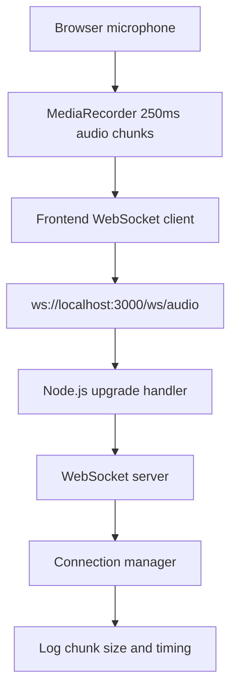

# Voice AI Backend

Node.js TypeScript WebSocket server for receiving streamed audio chunks.

## Run

```bash
cd backend
npm install
npm run dev
```

WebSocket endpoint:

```text
ws://localhost:3000/ws/audio
```

## Flow



## Logs

Each binary audio chunk logs its chunk number, size, timestamp, elapsed connection time, previous-chunk gap, and total bytes received.
