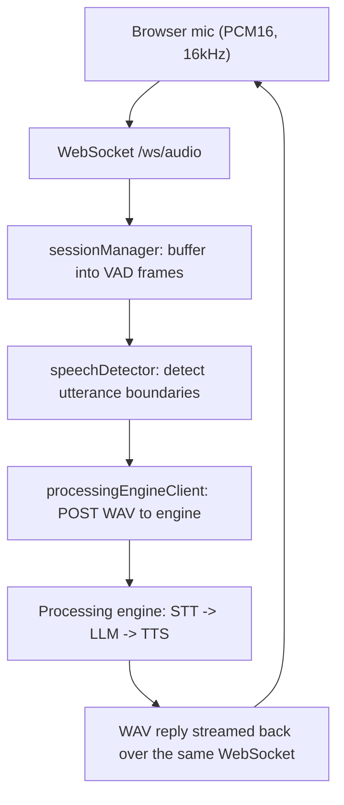

# Orchestrator Service

Node.js + TypeScript WebSocket server. It receives streamed PCM audio from the
browser, runs Voice Activity Detection to segment utterances, forwards each
complete utterance to the processing engine, and streams the synthesized WAV
reply back to the client.

## Run

```bash
cd orchestrator-service
npm install
npm run dev      # tsx watch, hot reload

# or, for a compiled build:
npm run build    # tsc -> dist/
npm start        # node dist/index.js
```

WebSocket endpoint:

```text
ws://localhost:3000/ws/audio
```

## Project structure

```
src/
  index.ts                       # Entry: HTTP server + WebSocket upgrade wiring
  config.ts                      # Env vars + audio/VAD constants
  types/
    session.ts                   # ClientSession type
    node-vad.d.ts                # Ambient types for the node-vad module
  audio/
    ringBuffer.ts                # Re-chunks incoming audio into fixed VAD frames
    wav.ts                       # Builds WAV headers around raw PCM
  vad/
    speechDetector.ts            # VAD state machine (utterance start/end)
  pipeline/
    processingEngineClient.ts    # POSTs utterances to the engine, returns the reply
  session/
    sessionManager.ts            # Per-connection lifecycle + state
```

## Data flow



## Environment variables

| Variable                | Default                  | Purpose                              |
| ----------------------- | ------------------------ | ------------------------------------ |
| `PORT`                  | `3000`                   | HTTP/WebSocket server port.          |
| `PROCESSING_ENGINE_URL` | `http://192.168.1.7:7001`| Base URL of the processing engine.   |

Copy `.env.example` to `.env` and adjust as needed.
